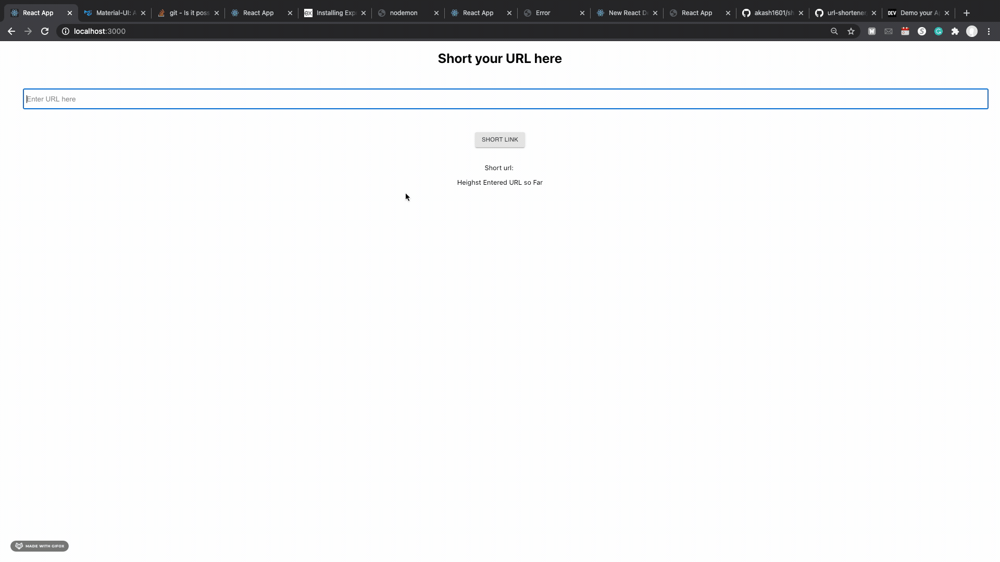

# short-url

The short-url app has functionalities to make a given URL shorter and globally Unique. 
User can  check URL is valid or not.
User can also see most entered URL in short-url app.

*frontend*
Developed using the react

*backend*
Developed using the Node

# Demo

## Follow these steps for connecting your mongodb cloud service and Bitly url shortner.

* MongoDB setting:
  * signup account for MongoDB cloud on https://www.mongodb.com/cloud
  * After creating new project you will see create cluster option 
  * create cluster https://docs.atlas.mongodb.com/tutorial/create-new-cluster/ this will help
  * build cluster update Cloud Provider & Region according to your requirements Cloud Provider & Region
  * it will take 2-3 minutes to build new cluster
  * add user: Go to under Security > Database Access > Add User > enter user name and password (Copy and Store your Password)
  * ip access: Go to under Security > Network Access and Add IP with 0.0.0.0/0 so All can get access
  * connect with your app: Go back to Atlas > connect > connect your application > copy connection string
  * update connection string: replace <password> with user password and <dbname> with database name  and copy this
  * edit .env file in server folder using this credentials
  * update variable `MONGO_DB_URL` with this connection string

* Bitly url shortner setting:
  * signup account for https://bitly.com
  * generate Token by PROFILE SETTING > GENERIC ACCESS TOKEN and then click on Generate Token and get ACCESS TOKEN
  * register your new app: Go to PROFILE SETTING > REGISTERED OAUTH APPS > REGISTER NEW APP
  * you will get there your Client ID and Client secret
  * edit .env file in server folder using these credentials. 
  * update these variables `BITLY_ACCESS_TOKEN`, `BITLY_CLIENT_ID` and `BITLY_CLIENT_SECRET`
  
First go into server folder and install all dependencies using `npm install` and then `npm start`
[http://localhost:8050](http://localhost:8050) server is using this port. 

You can change port number for server by updating .env `PORT` variable
If you are making this change then make sure to change client/short-url-global/package.json file's `proxy` variable.

Second open another terminal and go into client/short-url-global then use same `npm install` and `npm start` to run your react frontend
Open [http://localhost:3000](http://localhost:3000) to view it in the browser.

